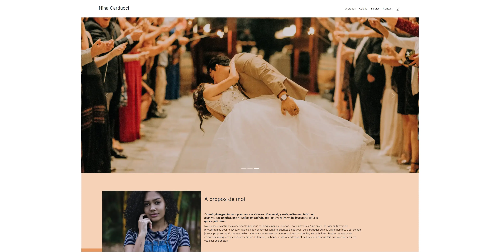

# WebOptimization-Debugging-SEO

WebOptimization-Debugging-SEO is a project centered around debugging, optimizing performance, and enhancing SEO for a web portfolio site. This project involves fixing functional bugs, improving site performance through image optimization, and enhancing accessibility and SEO. Tools like Lighthouse, WAVE, and schema.org were used to achieve these goals. The project is built using HTML, CSS, JavaScript, and jQuery.

## Table of Contents

- [Description](#description)
- [Screenshots](#screenshots)
- [Installation](#installation)
- [Usage](#usage)
- [Technologies Used](#technologies-used)
- [Contact](#contact)

## Description

WebOptimization-Debugging-SEO is a project focused on debugging, optimizing performance, and enhancing SEO for a web portfolio site. The project aims to fix functional bugs, enhance performance through image optimization, improve accessibility, and optimize SEO. HTML, CSS, JavaScript, and jQuery were used to build this project.

## Screenshots

## Installation

1. Clone the repository: `git clone https://github.com/Arkodarkk/WebOptimization_Debugging_SEO.git`
2. Navigate to the project directory: `cd WebOptimization_Debugging_SEO`

## Usage

1. Open the `index.html` file in a web browser to experience the optimized and enhanced website.

## Technologies Used

- HTML
- CSS
- JavaScript
- jQuery

## Contact

If you have any questions, suggestions, or feedback, feel free to contact me:

- Email: codecrushcontact@gmail.com
- GitHub: [Arkodarkk](https://github.com/Arkodarkk)
